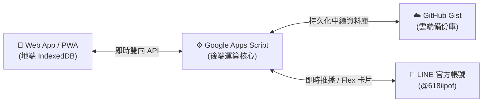

# 🐼 Daily Diet 飲食日記 — 全功能指令與雙向同步操作手冊

歡迎使用 **Daily Diet AI 飲食日記**！本系統支援 **Web App (PWA 模式)** 與 **LINE 官方帳號 (@618iipof)** 的 **100% 雙向雲端即時同步**。

---

## ⚡ 雲端同步機制與提示 (Sync Tips)

> [!TIP]
> **雙向同步小提醒**：
> 1. **Web ➔ LINE**：當您在 Web 端或桌面 PWA 記錄餐點、快速喝水或修改目標後，在 LINE 聊天室輸入 **`「今日」`** 或 **`「管理」`**，LINE 即會從雲端自動拉取最新餐點紀錄與進度條！
> 2. **LINE ➔ Web**：當您在 LINE 聊天室拍照或打字記錄餐點後，開啟 Web App 時會自動下載最新紀錄並更新圖表。
> 3. **免登入即用 (PWA)**：PWA 模式無需強制 LINE 登入，只要在 Web App 設定頁面輸入或生成專屬 Gist ID，並在 LINE 聊天室輸入 `綁定 <Gist ID>`，即可完成多裝置雲端連動！

---

## 💬 LINE 官方帳號指令大全

您可以在 LINE 聊天室輸入以下文字指令或傳送照片進行操作：

### 1. 📸 飲食記錄與辨識
| 指令 / 操作 | 範例說明 |
| :--- | :--- |
| **直接傳送食物照片** | AI 視覺辨識（Gemini 多模態引擎），自動計算熱量、蛋白質、水分與熊貓教練點評。 |
| **文字記錄餐點** | 輸入 `雞胸肉沙拉 350卡 30蛋` 或 `排骨便當 750卡`。 |
| **快速補水打卡** | 輸入 `喝水`、`+250水`、`喝水 500`、`500ml水`。 |

---

### 2. ✏️ 數值微調與修改
| 指令 / 操作 | 範例說明 |
| :--- | :--- |
| **修正上一餐數值** | 輸入 `改 400卡 35蛋` 或 `改成 500卡`。 |
| **修正指定餐點** | 輸入 `改 拿鐵 120卡 8蛋`。 |
| **刪除指定餐點** | 輸入 `刪除 雞胸肉沙拉` 或 `移除 珍珠奶茶`。 |

---

### 3. 🎯 體態目標管理
| 指令 / 操作 | 範例說明 |
| :--- | :--- |
| **查看目前目標** | 輸入 `目標`、`我的目標`、`每日目標`。 |
| **數值設定目標** | 輸入 `改目標 1800卡 120蛋 2500水`。 |
| **AI 智能計算目標** | 輸入 `改目標 165cm 55kg 女 減脂` 或 `改目標 178cm 72kg 男 增肌`，AI 將自動計算 BMR/TDEE 並量身推薦最佳熱量與蛋白質！ |

---

### 4. ⭐ 常用餐點庫 (收藏與快捷輪播)
| 指令 / 操作 | 範例說明 |
| :--- | :--- |
| **查看常用餐點輪播** | 輸入 `常用`、`收藏`、`快捷`、`常用清單`，支援左右滑動 Carousel 一鍵秒記錄。 |
| **新增常用餐點** | 輸入 `加常用 美式咖啡+茶葉蛋 160卡 14蛋 450水` 或 `新增常用 雞胸肉 200卡 40蛋`。 |
| **移除常用餐點** | 在常用輪播卡片點擊 `🗑️ 移除常用`，或輸入 `刪除常用 拿鐵`。 |

---

### 5. 📋 每日清單與管理
| 指令 / 操作 | 範例說明 |
| :--- | :--- |
| **查看今日飲食總結** | 輸入 `今日`、`今天`、`總結`、`統計`。 |
| **開啟管理面板** | 輸入 `管理`、`清單`、`紀錄`，可檢視今日所有餐點卡片並單筆刪除。 |
| **清空今日所有紀錄** | 在管理面板點擊 `🗑️ 清空今日紀錄`。 |

---

### 6. ☁️ 雲端連動與系統指令
| 指令 / 操作 | 範例說明 |
| :--- | :--- |
| **綁定 Web 雲端 Gist** | 輸入 `綁定 <您的 Gist ID>`（例如：`綁定 a1b2c3d4e5f6...`）。 |
| **開啟 Web App / 日記** | 輸入 `選單`、`App`、`主選單`、`日記`。 |
| **查看使用說明與教學** | 輸入 `說明`、`help`、`教學`、`歡迎`。 |

---

## 📱 Web App / PWA 快捷操作

1. **📷 AI 相機 / 上傳圖片**：支援拍照、相簿上傳或將照片直接拖曳進視窗。
2. **🚰 一鍵快速補水**：點擊右上角水滴按鈕，每次秒補 250ml。
3. **🌓 雙模式切換**：支援 Neo-Brutalist 潮流現代風 與 極致高對比深色模式。
4. **📊 週報與趨勢分析**：自動彙整 7 天平均熱量、蛋白質達標率與體重趨勢圖表。

---

## 🔒 隱私與安全性保證

1. **防盜刷時間戳記驗證**：Web 端與後端具備動態 HMAC 簽名與防重放攻擊機制。
2. **被遺忘權 (GDPR Compliance)**：在管理面板隨時可徹底銷毀個人資料。
3. **無廣告、無隱藏追蹤**：專注於極簡、快速與健康的飲食紀錄體驗！
